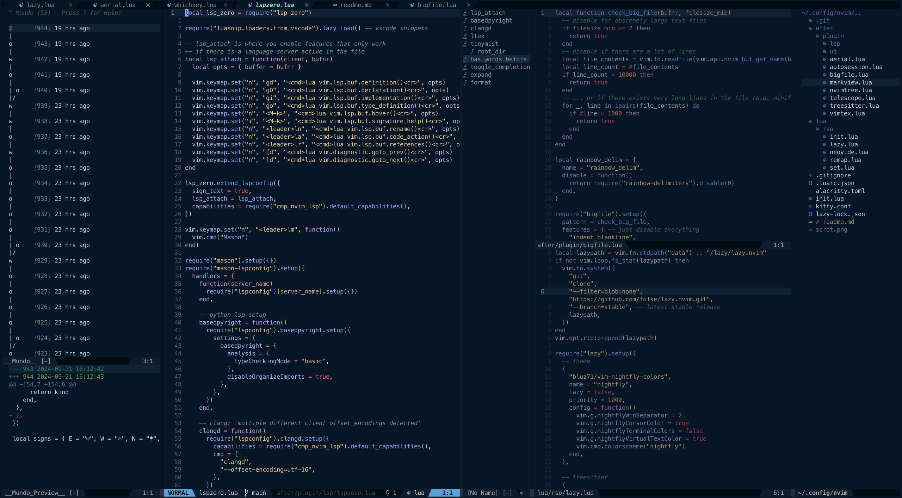

## nvim

This is my (richardso21's) personal NeoVim config, made completely from
scratch, with some help from
[ThePrimeagen](https://www.youtube.com/watch?v=w7i4amO_zaE).

Nothing too flashy, just something that kinda matches the VSCode vibe while
also being magnitudes faster. Presets like LazyVim and their gazillion
(opinionated) configs infuriate me more than they help. My config ended up being
~75% of LazyVim anyway, nonetheless I stand my ground.

> See `after/plugin/ui/whichkey.lua` for my preferred keyboard shortcuts.
>
> View `lua/rso/lazy.lua` for my list of plugins.

